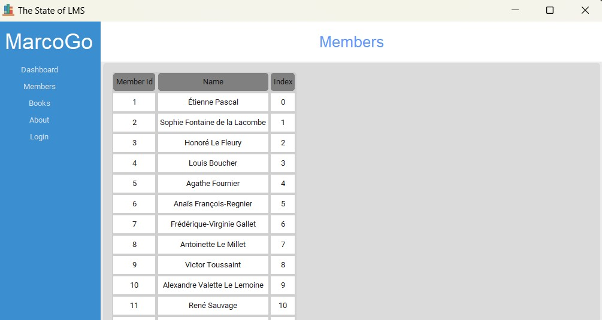

# Bibliotheksverwaltungssystem
[![Contributors][contributors-shield]][contributors-url]
[![Last Commit][last-commit-shield]][last-commit-url] 
[![Stargazers][stars-shield]][stars-url]
[![Issues][issues-shield]][issues-url]
 

# Intro
The LMS is an open source, design-focused and the collest **Python**-based Library Management System on GitHub. The **Main features are:**
-  Login 🔑 and Authentication through Sqllite database 😍
-  The ability to add, update, view and delete new records for:
        - Books
        - Members
- Secret Storage 👮 and handling using 💻 environment variables

# Screenshots
Here is a sneak peak of the application and it's visuals 😍:
 

    
      
     
Members 

 

# Tech Stack
Here  are most used and focus Tech 
- [Tkinter](https://docs.python.org/3/library/tk.html/) & [TTk](https://docs.python.org/3/library/tkinter.ttk.html) - For the user Interface
- [Matplotlib](https://matplotlib.org/) 📈 - For creating and showing graphs and visualizations
- [SQLite](https://www.sqlite.org/docs.html)
- [Faker](https://faker.readthedocs.io/en/master/)

# Getting Started
## Prerequisites
- Python 3 - [Download instructions here](https://www.python.org/downloads/)
- Pip 3 (usually gets installed automatically with Python)
- Git Installed
- VSC or PyCharm is installed
- Knowledge on **SQLite** [Doc](https://www.sqlite.org/docs.html)
## Contributions
- Clone the repo
- Cd to the folder
- pip install -r requirements.txt

# Specifications
Here are specification sof the application ... ( can be extended)

    
More info...

 
    1. Klasse Book:
        ◦ Attribute:
            ▪ title: Der Titel des Buches.
            ▪ author: Der Autor des Buches.
            ▪ isbn: Die ISBN-Nummer des Buches (eindeutige Kennung).
            ▪ available: Ein Boolean, der angibt, ob das Buch verfügbar ist oder ausgeliehen wurde.
        ◦ Methoden:
            ▪ __str__(): Gibt eine string-basierte Beschreibung des Buches zurück.
    2. Klasse Member:
        ◦ Attribute:
            ▪ name: Der Name des Mitglieds.
            ▪ member_id: Eine eindeutige Mitglieds-ID.
            ▪ borrowed_books: Eine Liste der Bücher, die das Mitglied ausgeliehen hat.
        ◦ Methoden:
            ▪ borrow_book(book): Ermöglicht einem Mitglied, ein Buch auszuleihen, sofern es verfügbar ist.
            ▪ return_book(book): Ermöglicht einem Mitglied, ein Buch zurückzugeben.
            ▪ __str__(): Gibt eine string-basierte Beschreibung des Mitglieds und der ausgeliehenen Bücher zurück.
    3. Klasse Library:
        ◦ Attribute:
            ▪ books: Eine Liste von Büchern, die die Bibliothek besitzt.
            ▪ members: Eine Liste der registrierten Mitglieder.
        ◦ Methoden:
            ▪ add_book(book): Fügt der Bibliothek ein Buch hinzu.
            ▪ remove_book(book): Entfernt ein Buch aus der Bibliothek.
            ▪ register_member(member): Registriert ein neues Mitglied in der Bibliothek.
            ▪ find_book_by_isbn(isbn): Findet ein Buch anhand seiner ISBN-Nummer.
            ▪ list_available_books(): Listet alle verfügbaren Bücher auf.
            ▪ list_borrowed_books(): Listet alle ausgeliehenen Bücher auf.
    4. Erweiterungsmöglichkeiten:
        ◦ Erstelle eine Benutzeroberfläche für das System (kann auch textbasiert sein).
        ◦ Implementiere eine Methode, um Bücher nach Autor oder Titel zu durchsuchen.
        ◦ Füge eine Klasse Librarian hinzu, die administrative Funktionen wie das Hinzufügen oder Entfernen von Büchern ausführt.
        ◦ Implementiere eine Funktion, die die Anzahl der Tage berechnet, die ein Buch ausgeliehen wurde, und möglicherweise eine Gebühr für verspätete Rückgaben berechnet.

[contributors-shield]: https://img.shields.io/github/contributors/marco0237/Bibliotheksverwaltungssystem.svg?style=for-the-badge
[contributors-url]: https://github.com/marco0237/Bibliotheksverwaltungssystem/graphs/contributors
[last-commit-shield]: https://img.shields.io/github/last-commit/marco0237/Bibliotheksverwaltungssystem?style=for-the-badge 
[last-commit-url]: https://github.com/Just-Moh-it/Bibliotheksverwaltungssystem/commit/main
[stars-shield]: https://img.shields.io/github/stars/marco0237/Bibliotheksverwaltungssystem.svg?style=for-the-badge 
[stars-url]: https://github.com/marco0237/Bibliotheksverwaltungssystem/stargazers
[issues-shield]: https://img.shields.io/github/issues/marco0237/Bibliotheksverwaltungssystem.svg?style=for-the-badge 
[issues-url]: https://github.com/marco0237/Bibliotheksverwaltungssystem/issues